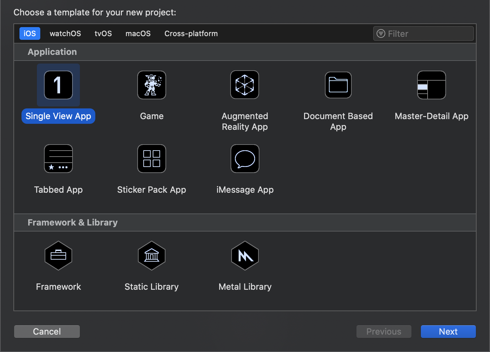
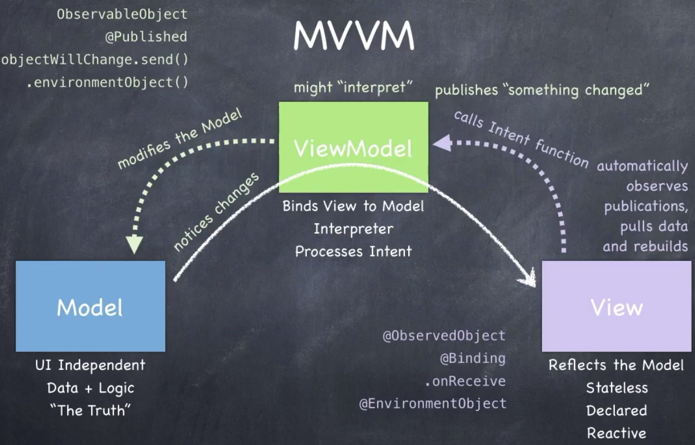
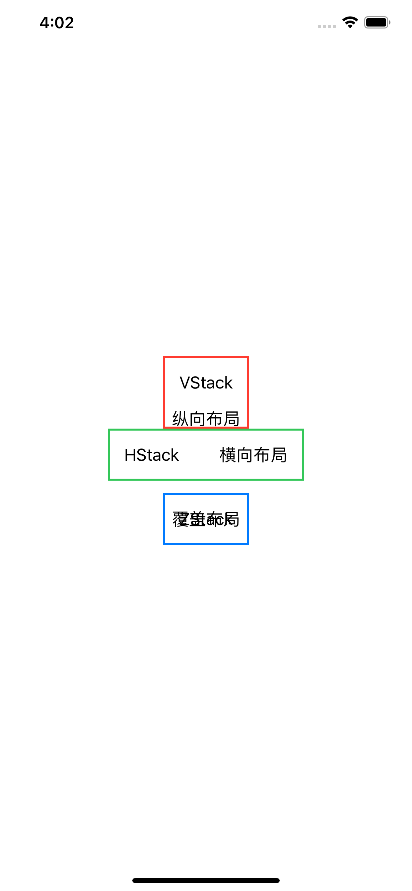

# SwiftUI
内容大多来自于 Standford-CS193p-2020Spring-SwiftUI
## Xcode 新建 SwiftUI 项目
新建 Single View App

运行 SwiftUI 项目可以直接通过左上角的 *Build and then run the current scheme* 运行 SwiftUI 项目

## Xcode 相关快捷键
* ⌘ + ↩ = 取消显示预览界面
* ⌘ + ⌥ + ↩ = 显示预览界面
* ⌘ + R = 编译并运行
* 按住 ⌥ = 提示代码相关信息

## 常用符号
⌘（command）

⌥（option）

⇧（shift）

⇪（caps lock）

⌃（control）

↩（return）

⌅（enter）

## MVVM 设计模式

### Model-View-ViewModel
反应式编程

* **Model** = Data + Logic，独立于前端
* **View** 反映出 **Model**，声明式(*declared*，不调用函数而是一开始就声明好的用户界面) + 反应式(*reactive*，对 **Model** 对变化作出反应)编程
* **ViewModel** 将 **Model** 与 **View** 绑定，在 **View** 中解释(*interpreter*)变化的 **Model**

## 基础语法
### print
使用 **print** 时，占位符可以使用 ```\(var)``` 的形式
```swift
let name: String = "World"
print("Hello \(name)")
```

### for
```swift
for index in 0..<upperBound {
    // 从 0 到 upperBound
}
```

### 闭包(*closure*)
```swift
// 定义一个存放 Int 的 struct
struct SquareStruct {
    // 在 struct 中定义的成员变量
    var squareList: Array<Int>

    // 在 struct 中定义的 init 函数
    init(count: Int, squareFactory: (Int) -> Int) {
        // 初始化成员变量 squareList
        squareList = Array<Int>()
        // 为 squareList 赋值，从 0 到 index 的平方
        for index in 0..<count {
            let result = squareFactory(index)
            squareList.append(result)
        }
    }
}
// 使用闭包声明
var squareStruct: SquareStruct = SquareStruct(count: 4, squareFactory: {index in index * index})
print(squareStruct)
```
输出为
```
SquareStruct(squareList: [0, 1, 4, 9])
```
在上面的代码中，```squareStruct``` 变量的 ```init``` 函数使用闭包进行声明，在 ```squareFactory: {index in index * index}``` 声明了 ```squareFactory``` 以何种方式处理在 struct 的 ```init``` 中定义的 ```squareFactory: (Int) -> Int```，即采用 ```index * index``` 作为返回值。其中 <u>```index```</u>``` in index * index``` 的 ```index``` 作为 ```let result = squareFactory(index)``` 的参数。如果实际使用时不需要参数，可以用 ```_``` 替代 <u>```index```</u>（```_```作为参数，代表缺省）

### struct 与 class
#### struct 与 class 的共同点
包含以下内容
* 变量 ```var```
    ```swift
    var flag: Bool
    var body: some View {
        return Text("Hello World")
    }
    ```
* 常量 ```let```
    ```swift
    let myConstantColor = Color.blue
    ```
* 函数 ```func```
    ```swift
    func mul(_ num1: Int, by num2: Int) -> Int {
        // _ 与 by 暴露给外部接口进行调用，起到标签作用
        // _ 代表没有标签(label)，外部调用时是 mul(1, by: 2)
        // num1 与 num2 作为该函数内部变量使用
        // 这样的方式在外部调用时更符合英文语法习惯
        return num1 * num2
    }
    init(initVal: Int) {
        // 类似于构造函数
    }
    ```

#### struct 与 class 的不同点
* **struct** 是一种 *value type*(拷贝副本传递，写时复制)，**class** 是一种 *reference type*(通过指针传引用，无指针则被回收)
* **struct** 无法被继承，**class** 可以被继承（单继承）
* **struct** 在调用 ```init``` 时需要声明全部变量，**class** 可以使用无参构造函数
* **ViewModel** 是一种 **class**，**View** 是一种 **protocol**，其他一切都是 **struct**

### protocol
* **protocol** 是一种含 ```func``` 和 ```var``` 但无实现的特殊 **struct** / **class**（类似于 Java 中的 Interface，但可以实例化对象）
    
    由于在定义 ```func``` 时没有进行函数实现，在定义时参数只需要定义外部调用时的标签(label)，不需要定义函数内调用时的变量名
    ```swift
    protocol Moveable {
        func move(by: Int)
        // var 后声明的 get 与 set 表明了该变量是否可以被获取、设置
        var hasMoved: Bool { get }
        var distanceFromStart: Int { get set }
    }
    ```
* **protocol** 的实现（继承）机制
  
    **protocol** 依然可以被 **protocol** 继承
    ```swift
    protocol Vehicle: Moveable {
        var passengerCount: Int { get set}
    }
    ```
    声明了 **protocol** 后，**struct** / **class** 在实现该 **protocol** 时，所有在 **protocol** 中声明的 ```func``` 与带 ```set``` 方法的 ```var``` 都必须要实现（父 **protocol** 中定义的 ```func``` 与含 ```set``` 方法的 ```var``` 当然也要一并实现）
    ```swift
    // 此处可以是 struct 也可以是 class 来实现 protocol
    struct Car: Vehicle {
        func move(by moveDistance: Int) {
            distanceFromStart = moveDistance
        }
        var distanceFromStart
    }
    ```
    一个**struct** / **class** 可以同时实现（继承）多个 **protocol**，当然每个 **protocol** 中定义的 ```func``` 与含 ```set``` 方法的 ```var``` 全部都要实现
* **protocol** 是一种向前兼容的 type
    
    凡是实现了该 **protocol** 的 **struct** / **class**，都可以直接声明变量并赋给类型为该 **protocol** 的变量
    ```swift
    var m: Moveable
    // 假设前文实现了名为 Car 的 class
    var car: Car = new Car(type: "Tesla")
    // 假设前文实现了名为 PortableThing 的 struct
    var portable: PortableThing = PortableThing()
    // 以下语句都是合法的
    m = car
    m = portable
    ```

### 范型
* 范型变量
    ```swift
    struct StructName<Element> {
        ...
        func operate(_ element: Element) {
            ...
        }
    }
    // 范型的使用与 Java 类似
    var structName = StructName<Int>()
    structName.operate(1)
    ```

* 范型函数

    SwiftUI 支持将函数的参数以及返回结果作为声明一个变量的参数，直接将函数赋值给变量
    ```swift
    // 声明一个参数为 Double，返回值为 Double 的变量
    var operation: (Double) -> Double
    // 声明一个参数为 Double，返回值为 Double 的函数
    func square(val: Double) -> Double {
        return val * val
    }
    // 将参数、返回值相同的函数赋值到变量
    operation = square
    // 变量代入参数，将返回值赋值到其他新变量
    // 此时调用函数不需要声明标签(label)
    let result = operation(2)
    ```

## [前端相关控件](https://developer.apple.com/documentation/swiftui/views-and-controls)


### 布局容器
不同的布局容器，会按不同的布局方式将容器内的组件放置
* VStack：纵向布局
* HStack：横向布局
* ZStack：覆盖布局
```swift
struct ContentView: View {
    var body: some View {
        VStack {
            VStack {
                Text("VStack").padding()
                Text("纵向布局")
            }.border(Color.red, width: 2)
            HStack {
                Text("HStack").padding()
                Text("横向布局").padding()
            }.border(Color.green, width: 2)
            ZStack {
                Text("ZStack").padding()
                Text("覆盖布局").padding(5)
            }.border(Color.blue, width: 2)
        }
    }
}
```
