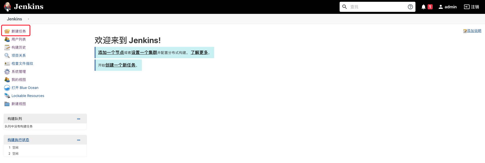
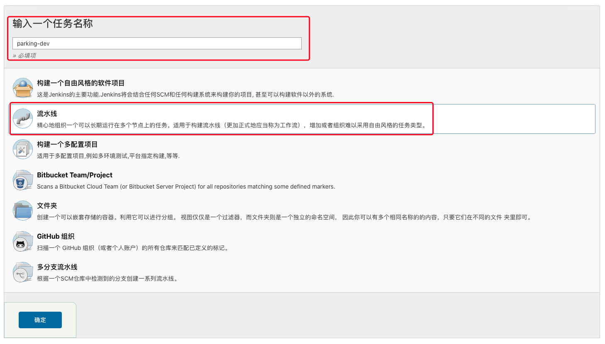
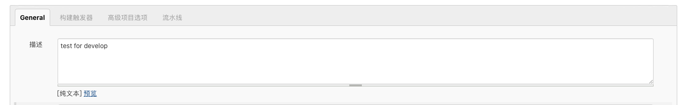
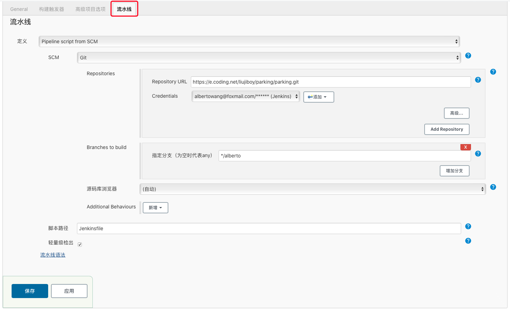

# Jenkins 入坑
## 使用 docker 构建的 Jenkins
1. 命令行输入以下命令，pull 个 Jenkins 的镜像下来

	```sh
	docker run --rm -u root -p 8080:8080 -v jenkins-data:/var/jenkins_home -v /var/run/docker.sock:/var/run/docker.sock -v "$HOME":/home jenkinsci/blueocean
	```
	* ```--rm``` 选项是在该容器停止后自动进行 rm 操作
	* ```jenkins-data``` 的作用是映射容器中的 ```/var/jenkins_home``` 到 docker 空间的的卷中
	* ```"$HOME"``` 是将宿主机的目录映射到容器的 ```/home``` 目录

2. 进入 jenkins 的 docker 容器的 bash
	
	```sh
	docker exec -it <ContainerID> bash
	```

3. 解锁
	
	第一次进入时，控制台会输出一个密钥，复制粘贴即可。过后进入时，进入 Jenkins 容器中的 ```/var/jenkins_home/secrets```，使用 cat 命令查看密钥
	
	```sh
	cat /var/jenkins_home/secrets/initialAdminPassword
	```

4. 新建 Jenkinsfile 并 commit 到 git 项目中

	对于 Maven 项目，新建一个 Jenkinsfile 文件，包含以下内容
	
	```txt
	pipeline {
 	   agent {
        	docker {
            	image 'maven:3-alpine' 
            	args '-v /root/.m2:/root/.m2' 
        	}
    	}
    	stages {
        	stage('Build') { 
            	steps {
            	    sh 'mvn -B -DskipTests clean package' 
           	 }
        	}
   	 }
	}
	```
	
	其中 ```args``` 的参数声明了宿主机：容器的 Maven 仓库映射

5. 构建流水线
	
	* 新建任务 
	* 填写任务名称，选择*流水线（pipeline）*
	
	* General 中填写构建流水线描述
	
	* 进入*流水线选项卡*，定义选择 *Pipline script from SCM* -> SCM 选择 *git*，*Repository URL* 填写 git 地址，*Credentials* 填写权限凭证（代码托管平台账号与密码），*Branches to build* 选择 git 所使用的 branch
	
	* 保存后返回 Jenkins 主页并*立即构建*，构建过程可以在主页的*打开 Blue Ocean* 查看

## 构建过程的问题汇总
### 主启动类缺失
报错
```
Execution repackage of goal org.springframework.boot:xxx:repackage failed: Unable to find main class
```
考虑是否有哪个子 module 没有声明主启动类
```java
@SpringBootApplication
public class Application {
	public static void main(String[] args) {
		SpringApplication.run(Application.class, args);
	}
}
```
### 缺少某个 jar 包
```
Failed to execute goal org.apache.maven.plugins:maven-compiler-plugin:3.8.1:testCompile (default-testCompile) on project parking-admin-service: Compilation failure: Compilation failure: 
[ERROR] /var/jenkins_home/workspace/parking-dev/parking-admin-service/src/test/java/cn/edu/cqu/***/***Test.java:[6,24] package org.junit.runner does not exist
[ERROR] /var/jenkins_home/workspace/parking-dev/parking-admin-service/src/test/java/cn/edu/cqu/***/***Test.java:[15,2] cannot find symbol
[ERROR]   symbol: class RunWith
```